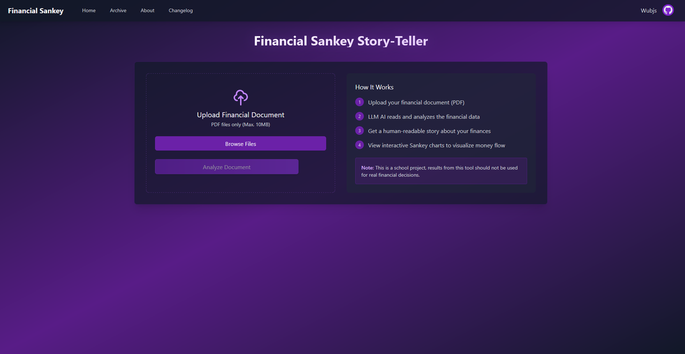
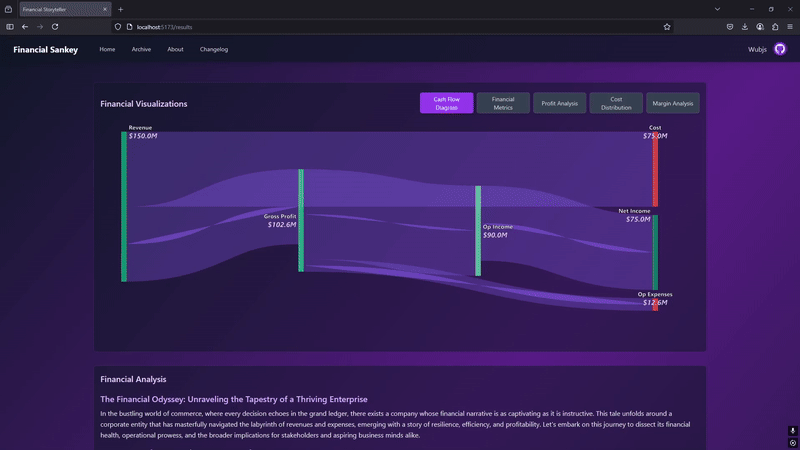

# Financial-Sankey-StoryTeller

## Description
This project is designed to parse large financial documents into JSON files of just the income statements. The idea is to find the context and "story" of what the data shows and use an LLM to explain it.

## Preview


> The home page of Financial Sankey Story-Teller — upload a PDF, and the app generates a story and a Sankey chart from your financial data.

## Demo


> This is a demo of the financial results done with NVIDIA

## Tech Stack
- **Frontend**: React & Vite & TypeScript + recharts
- **Middleware**: FastAPI & CORS (Cross-Origin Resource Sharing)
- **Backend**: Python & PyMuPDF
- **LLMS**: Granite 3.3  & 3.2-vision


### Specific Use Case
- Vite: Open Source React and TypeScript Packaged Framework
- React: Javascript Framework, easy to use
- Typescript: Has everything about Javascript and more, and free!
- FastAPI: For connection between front and back-end
- CORS: For cross communication handling file upload between front to back then front again.
- Python: Good for integration of libraries for this project
- PyMuPDF: Helps with accessing and parsing the PDF document
- Granite 3.3: Works well with 3.2-vision model, used for story generation.
- Granite 3.2-vision: Specifically fine-tuned for documents and looking at charts, graphs, and such. Used for creating a JSON and getting the income statement.


##  System Requirements

For detailed hardware/software requirements, [see requirements.md](./requirements.md).

## Installation
1. Clone the repository:
    ```bash
    git clone https://github.com/Ethan-pyjs/FinancialProject.git
    ```
2. Navigate to the project directory:
    ```bash
    cd Financial-Sankey-StoryTeller
    ```
3. Install dependencies:
    ```bash
    npm install
    npm run dev
    ```

4. Backend Installation
    ```bash
    cd Backend-Finance
    ```
5. Install Dependencies
    ```bash
    pip install -r requirements.txt
    ```
6. Run the server (Note: Make sure ollama is installed and all models are ready)
    ```bash
    uvicorn main:app --reload
    ```
    OR
    ```bash
    python main.py
    ```
## License
This project is licensed under the [MIT License](LICENSE).
